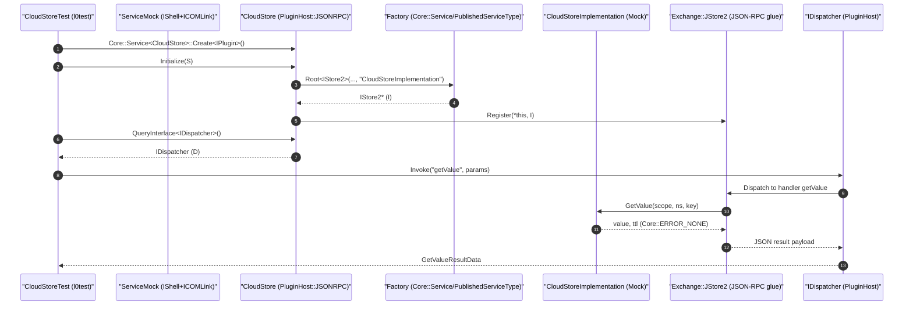

# CloudStore l0test Linking Flow and Runtime Interactions

## Overview

This document explains how the CloudStore l0 tests compile and link against WPEFramework (Core/PluginHost/COM/JSON-RPC) and Exchange/Definitions, and how the runtime flow works when CloudStore is exercised through JSON-RPC in tests. The goal is to keep the content concise while mapping code-level references to link-time requirements and illustrating the component interactions.

In the CloudStore plugin:
- PluginHost and JSON-RPC usage: CloudStore inherits from `PluginHost::JSONRPC` and uses `PluginHost::IShell` in `CloudStore.h`/`CloudStore.cpp`. These references require WPEFramework Plugins and Core to be present at build and link time.
- COM usage: Interface maps (`BEGIN_INTERFACE_MAP`, `INTERFACE_ENTRY`) and `Core::Service<>::Create<>` are used in CloudStore and tests. These come from the COM/Core infrastructure and require linking WPEFramework Core and COM.
- Exchange interfaces: CloudStore interacts with `Exchange::IStore2` and registers JSON-RPC methods via `Exchange::JStore2` (see `CloudStore.h` and `CloudStore.cpp`). The Exchange (ThunderInterfaces) headers are provided by the WPEFramework installation (e.g., `include/WPEFramework/interfaces`). Typically, these are headers-only for interfaces; no extra link library is needed for the interface declarations themselves.
- JSON types: The tests use generated JSON data types for Store2 methods (e.g., `JsonData_Store2::GetValueParamsInfo`). In l0 tests these are satisfied by local stubs under `CloudStore/l0test/stubs/WPEFramework/interfaces/json/JsonData_Store2.h` and `.../JStore2.h`, which depend on WPEFramework Core and Plugins.

In the l0 tests:
- `CloudStoreTest.cpp` constructs `CloudStore` via `Core::Service<CloudStore>::Create<IPlugin>()`, initializes the plugin with a mock `IShell` (`ServiceMock.h`), and then drives JSON-RPC via `PluginHost::IDispatcher`.
- The test publishes a `CloudStoreImplementation` (derived from `CloudStoreImplementationMock`) with `PublishedServiceType` so that `CloudStore::Initialize` can resolve an `IStore2` implementation via `service->Root<Exchange::IStore2>(..., "CloudStoreImplementation")` without a separate process.

## What forces links to WPEFramework and Exchange

This section maps specific code references to the link-time requirements observed in this repository:

- WPEFramework Core (`WPEFramework::Core`):
  - `Core::Service<T>::Create<>()` in `CloudStoreTest.cpp` and `CloudStoreImplementation.cpp`
  - JSON containers and types used by generated/stub JSON code in `JsonData_Store2.h`
  - Used pervasively by PluginHost and JSON-RPC layers

- WPEFramework COM (`WPEFramework::COM`):
  - Interface maps and COM identity in `CloudStore.h`/`CloudStore.cpp` and mocks (`ServiceMock.h`)
  - `RPC::IRemoteConnection` usage in `CloudStore.h` and `CloudStore.cpp`

- WPEFramework Plugins (`WPEFramework::Plugins`):
  - `PluginHost::JSONRPC` base class in `CloudStore.h`
  - `PluginHost::IDispatcher` queried in `CloudStoreTest.cpp`
  - JSON-RPC registration in `CloudStore.cpp` via `Exchange::JStore2::Register(*this, _store2)`

- WPEFramework Definitions / Exchange (ThunderInterfaces headers):
  - `#include <interfaces/IStore2.h>` in `CloudStore.h` and `CloudStoreImplementation.h`
  - `#include <interfaces/json/JStore2.h>` in `CloudStore.h` (fulfilled by local stub in l0 tests)
  - Typically header-only interfaces for compile-time; linking is still required for Core/COM/Plugins

- Generated JSON-RPC data and glue (fulfilled by l0 test stubs):
  - `CloudStore/l0test/stubs/.../JsonData_Store2.h` and `.../JStore2.h`
  - Depend on WPEFramework Core (JSON types) and Plugins (JSONRPC APIs)

## Configure → Compile → Link → Run

The l0 tests typically discover WPEFramework and interfaces via CMake config packages installed under `dependencies/install`. The primary resolution path is through `CMAKE_PREFIX_PATH`, which must include the `dependencies/install` directory that contains CMake config files such as `WPEFrameworkCore.cmake`, `WPEFrameworkCOM.cmake`, `WPEFrameworkPlugins.cmake`, and `WPEFrameworkDefinitions.cmake`.

- Configure
  - Set CMAKE_PREFIX_PATH to point to the local WPEFramework install prefix:
    - Example: `-DCMAKE_PREFIX_PATH=${PROJECT_ROOT}/dependencies/install`
  - `find_package(...)` resolves the exported targets for WPEFramework components and ensures include paths (e.g., `include/WPEFramework/...`) are available.

- Compile
  - Tests and plugin sources include headers:
    - `plugins/JSONRPC.h`, `plugins/Service.h` (PluginHost)
    - `core/JSON.h`, `core/Core.h` (Core)
    - `com/...` (COM)
    - `interfaces/IStore2.h` and JSON-generated headers (Exchange)
  - l0 stubs under `CloudStore/l0test/stubs/...` satisfy generated header requirements locally for the unit test binary.

- Link
  - `target_link_libraries` pulls in the required WPEFramework components. A typical pattern is:
    - `WPEFramework::Core`, `WPEFramework::COM`, `WPEFramework::Plugins`, and `WPEFramework::Definitions`
  - Exchange interface headers are included from the WPEFramework install; typically no additional link library is required for the interface declarations themselves in this in-process test scenario.

- Run
  - The resulting gtest binary runs locally. Because the test publishes the `CloudStoreImplementation` in-process, there is no separate WPEFramework process involved.
  - Ensure `LD_LIBRARY_PATH` includes `${PROJECT_ROOT}/dependencies/install/lib` (and, if needed, `${PROJECT_ROOT}/dependencies/install/lib/wpeframework`) so the dynamic linker can find WPEFramework libraries.

A minimal CMake example (adapt naming to your local toolchain and exported target names):
```cmake
# Assumes: -DCMAKE_PREFIX_PATH=${PROJECT_ROOT}/dependencies/install
find_package(WPEFrameworkCore REQUIRED)
find_package(WPEFrameworkCOM REQUIRED)
find_package(WPEFrameworkPlugins REQUIRED)
find_package(WPEFrameworkDefinitions REQUIRED)

add_executable(cloudstore_l0test
  CloudStoreTest.cpp
  ServiceMock.h
  # Optional: include or link the CloudStore plugin objects if not already built as a library
)

target_link_libraries(cloudstore_l0test
  PRIVATE
    WPEFramework::Core
    WPEFramework::COM
    WPEFramework::Plugins
    WPEFramework::Definitions
    GTest::gtest
    GTest::gmock
)
```

## l0test execution sequence

The following sequence reflects the actual control flow in the unit test when invoking JSON-RPC methods such as `getValue`, `setValue`, `deleteKey`, and `deleteNamespace`. It mirrors the code in `CloudStoreTest.cpp`, `CloudStore.h/.cpp`, and the l0 stubs.



Key points:
- The `PublishedServiceType<CloudStoreImplementation>` in the test publishes a factory so that `service->Root<Exchange::IStore2>(..., "CloudStoreImplementation")` returns the test mock implementation.
- `Exchange::JStore2::Register(*this, _store2)` installs JSON-RPC handlers for Store2 calls on the plugin’s JSON-RPC dispatcher. The l0 stub implements these registrations and is used in tests.

## Block diagram: components and dependencies

The block diagram shows the major components, their relationships, and the nature of dependencies (headers, link-time, runtime). In l0 tests, all components run in-process.

```mermaid
flowchart LR
  subgraph L0["l0test binary (gtest)"]
    T["CloudStoreTest.cpp"]
    SM["ServiceMock (IShell+ICOMLink)"]
  end

  subgraph PLUG["CloudStore plugin"]
    CS["CloudStore (PluginHost::JSONRPC)"]
    MOD["Module.cpp (MODULE_NAME_DECLARATION)"]
  end

  I["CloudStoreImplementationMock (IStore2)"]
  J["JStore2 (test stub, JSON-RPC glue)"]
  JD["JsonData_Store2 (test stub, JSON types)"]

  subgraph WPE["WPEFramework libraries"]
    WCORE["Core"]
    WCOM["COM"]
    WPLUG["Plugins (PluginHost/JSON-RPC)"]
    WDEF["Definitions"]
  end

  subgraph EXC["Exchange/Interfaces (headers)"]
    XIF["IStore2, IConfiguration"]
  end

  %% compile-time includes
  T -->|includes| CS
  T -->|includes| SM
  CS -->|includes| XIF
  CS -->|inherits| WPLUG
  JD -->|includes| WCORE
  J -->|uses JSONRPC| WPLUG

  %% link-time deps
  L0 -. links .-> WCORE
  L0 -. links .-> WCOM
  L0 -. links .-> WPLUG
  L0 -. links .-> WDEF

  %% runtime interactions (in-process)
  T -->|Initialize(SM)| CS
  CS -->|Register handlers| J
  CS -->|Query Root<IStore2>| I
  T -->|IDispatcher::Invoke| CS
  J -->|calls| I
```

Notes:
- Exchange interfaces are header-only for the purposes of these l0 tests. The WPEFramework installation provides `include/WPEFramework/interfaces/...`.
- The test stubs for `JStore2` and `JsonData_Store2` are used only for l0 testing and depend on WPEFramework Core and Plugins.

## Brief host-run notes

For local host runs of the l0 tests:
- Ensure the dynamic linker can find WPEFramework libraries:
  - `export LD_LIBRARY_PATH=$PWD/dependencies/install/lib:$PWD/dependencies/install/lib/wpeframework:$LD_LIBRARY_PATH`
- No separate WPEFramework daemon is required; tests run in-process and publish the `CloudStoreImplementation` via `PublishedServiceType`.
- If your environment packages JSON-RPC proxy stubs separately and you are exercising cross-process COM, add proxystubs as needed:
  - `export LD_LIBRARY_PATH=$PWD/dependencies/install/lib/wpeframework/proxystubs:$LD_LIBRARY_PATH`
  - For these l0 tests (in-process), this is typically not required.

## References to code in this repo

- CloudStore plugin: `CloudStore.h`, `CloudStore.cpp`, `Module.cpp`
- CloudStore implementation: `CloudStoreImplementation.h`, `CloudStoreImplementation.cpp`
- l0 tests: `CloudStoreTest.cpp`, `ServiceMock.h`, `CloudStoreImplementationMock.h`
- l0 JSON stubs: `stubs/WPEFramework/interfaces/json/JStore2.h`, `.../JsonData_Store2.h`
