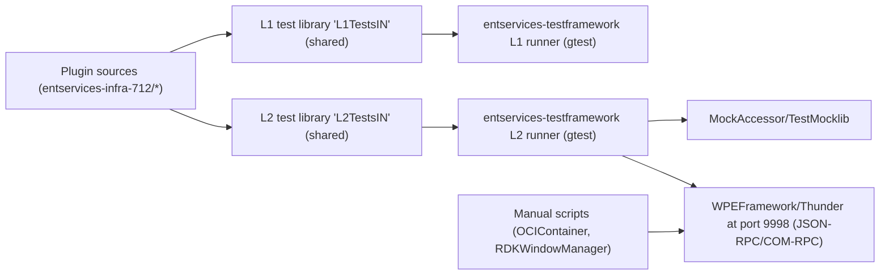

# ADR: L1 and L2 Testing Strategy for entservices-infra-712

## Context
The entservices-infra-712 repository provides a set of WPEFramework (Thunder) plugins and supporting components for enterprise services. Testing in this repository is organized into layered levels and uses a central test framework shared across multiple entservices repositories. This ADR documents the current strategy, scope, tools, execution model, and status for L1 (unit/static) and L2 (integration) testing. It also highlights existing scripts that support higher-level verification and provides references to the concrete configuration files present in this repository.

Historically, GoogleTest/GoogleMock stubs and common mocks have been centralized in the separate entservices-testframework repository. As a result, each entservices-* repository (including this one) contributes its test sources and compiles them into shared libraries that are consumed by the central test runners produced by the entservices-testframework project. In this repo, L1 tests reside under Tests/L1Tests and L2 tests under Tests/L2Tests. Some subcomponents also carry their own l0/l1/l2 test folders (for example, CloudStore and PersistentStore), but this ADR focuses on the repository-wide L1 and L2 test layers.

## Decision
We standardize the testing approach for entservices-infra-712 as follows:
- Maintain a clear separation between L1 and L2 tests in this repository, building each layer into a shared library that is installed and then linked/consumed by the centralized entservices-testframework runners.
- Keep common mocks and GTest/GMock scaffolding in the entservices-testframework repo, while keeping module-specific test sources in this repo.
- Drive the inclusion of specific module tests via CMake options (e.g., plugin flags such as PLUGIN_USBDEVICE and test-layer flags such as RDK_SERVICES_L1_TEST and RDK_SERVICE_L2_TEST).
- Use Thunder (WPEFramework) JSON-RPC/COM-RPC integrations in L2 tests with the default port 9998 where applicable, linking to MockAccessor and TestMocklib when needed.
- Retain auxiliary verification scripts (for example, OCIContainer JSON-RPC script and RDKWindowManager JSON-RPC script) for manual or exploratory testing outside the core L1/L2 execution path.

This decision aligns the repository with the broader entservices-* ecosystem, preserves reuse of shared mocks, and avoids duplication of the test harness.

## Scope & Definitions (L1 vs L2)
- L1 (Unit/Static Layer):
  - Intent: Validate plugin and component logic in isolation with mocks. Focus on method behavior, interface contracts, error handling, and boundary conditions.
  - Location: Tests/L1Tests (compiled into a shared library named L1TestsIN).
  - Dependency Model: Links against the plugin under test and includes mock headers from entservices-testframework. Does not require a running Thunder instance.
  - Examples: tests/test_USBDevice.cpp, tests/test_USBMassStorage.cpp, tests/test_Telemetry.cpp, tests/test_AppManager.cpp, tests/test_RunTimeManager.cpp, tests/test_UserSettings.cpp, tests/test_ResourceManager.cpp, tests/test_StorageManager.cpp, tests/test_UtilsFile.cpp.

- L2 (Integration Layer):
  - Intent: Validate integration paths across plugins and their Thunder interfaces using JSON-RPC/COM-RPC, exercising more system-like behaviors. Often relies on MockAccessor/TestMocklib and can interact with a local Thunder instance on port 9998 when needed.
  - Location: Tests/L2Tests (compiled into a shared library named L2TestsIN).
  - Dependency Model: Includes MockAccessor/TestMocklib and entservices-testframework L2 plugin headers; may expect running Thunder or use mocks based on configuration.
  - Examples: tests for Analytics, AppManager, ResourceManager, StorageManager, Telemetry, USBDevice, UsbAccess, UsbMassStorage, SharedStorage, and OCIContainer.

Note: Some subdirectories (e.g., CloudStore and PersistentStore) include additional l0/l1/l2 tests for their internal modules. These are complementary and follow the same principles but are not the focus of this ADR.

## Tooling & Frameworks
The repository uses:
- Build and configuration:
  - CMake-based builds (top-level CMakeLists.txt adds Tests/L1Tests and Tests/L2Tests via flags).
  - Per-layer CMakeLists to manage test composition and linking.
  - Compiler configuration files in Tests/ (clang.cmake and gcc-with-coverage.cmake) to switch toolchains and enable coverage flags.
- Test frameworks and mocks:
  - GoogleTest/GoogleMock are leveraged through the centralized entservices-testframework repository, which provides mock headers and a runner that links to the shared test libraries compiled in this repo.
  - L2 tests include MockAccessor and, when not using OOP RPC mode, TestMocklib.
- Thunder/WPEFramework integration:
  - L2 tests are compiled with THUNDER_PORT set to 9998. JSON-RPC and COM-RPC interfaces are exercised through Thunder.
- Auxiliary verification scripts:
  - OCIContainer JSON-RPC shell tool (OCIContainer/test/ociContainerTest.sh).
  - OCIContainer WebSocket integration test (OCIContainer/test/thunder-ocicontainer-test.js).
  - RDKWindowManager JSON-RPC script and associated test README (RDKWindowManager/test).

## Test Execution & CI Integration
- Build-time flags:
  - Enable L1 tests: pass -DRDK_SERVICES_L1_TEST=ON to CMake.
  - Enable L2 tests: pass -DRDK_SERVICE_L2_TEST=ON (note: singular SERVICE in the variable name).
  - Include specific plugin tests by enabling the corresponding PLUGIN_* options (e.g., -DPLUGIN_USBDEVICE=ON, -DPLUGIN_TELEMETRY=ON, -DPLUGIN_OCICONTAINER=ON, etc.).
- How tests are built:
  - L1 tests (Tests/L1Tests/CMakeLists.txt) compile into a shared library named L1TestsIN and link to the plugin targets under test plus the shared mocks from entservices-testframework.
  - L2 tests (Tests/L2Tests/CMakeLists.txt) compile into a shared library named L2TestsIN and link to ${NAMESPACE}Plugins and MockAccessor (and TestMocklib if NOT L2_TEST_OOP_RPC). THUNDER_PORT is defined for test code.
  - Both libraries are installed into the repository’s install/lib tree (as configured via CMAKE_INSTALL_PREFIX).
- How tests are executed:
  - Centralized execution: The entservices-testframework repository builds L1/L2 runners that link to the libraries produced here. This repository itself does not produce standalone gtest executables for L1/L2.
  - Local runs (as documented in Tests/README.md): The common workflow uses nektos/act to drive GitHub workflows that build mocks, build this repo’s test libraries, and then build and run the centralized entservices-testframework runners. The specific .github workflows referenced in Tests/README.md are not present in this repository; test execution is typically coordinated from entservices-testframework or from CI in other repos.
  - Manual verification: Additional scripts are provided for interactive or scenario-driven testing (OCIContainer/test/ociContainerTest.sh, OCIContainer/test/thunder-ocicontainer-test.js, and RDKWindowManager/test/RDKWMJsonL3Test.sh). These are outside the automated L1/L2 execution flow but are useful for end-to-end checks during development.
- CI status:
  - Tests/README.md states that individual entservices-* repos are set up to trigger L1, L2, and L2-OOP test jobs via GitHub workflows and that entservices-testframework can orchestrate repository tests through its own workflows (tf-trigger). However, this repository does not currently include those .github workflow files, so CI execution for L1/L2 depends on external orchestrations or local act-based runs against appropriate workflows.

### Example local build (building libraries)
Below is an example CMake invocation that mirrors typical CI flags (adapt as needed):
```
cmake -S . -B build \
  -G Ninja \
  -DRDK_SERVICES_L1_TEST=ON \
  -DRDK_SERVICE_L2_TEST=ON \
  -DPLUGIN_USBDEVICE=ON \
  -DPLUGIN_USB_MASS_STORAGE=ON \
  -DPLUGIN_OCICONTAINER=ON \
  -DPLUGIN_TELEMETRY=ON \
  -DCMAKE_INSTALL_PREFIX=$PWD/install/usr

cmake --build build --target install
```
To incorporate coverage flags:
- Use Tests/gcc-with-coverage.cmake (adds --coverage) or, for clang, Tests/clang.cmake.

Note: Running the tests is normally done via the entservices-testframework runners. This repository provides the test libraries but not standalone executables.

## Coverage & Quality Gates
- Coverage:
  - Tests/gcc-with-coverage.cmake enables GCC coverage instrumentation via --coverage on C++ builds.
  - The cov_build.sh script builds the repository with coverage, L1 tests enabled, and many plugin flags toggled on, and it includes the entservices-testframework mock headers via include directives.
  - There is no gcovr/llvm-cov integration documented in this repository; reports and thresholds, if any, are typically managed by the external CI/workflows or by the testframework pipeline.
- Static analysis:
  - cov_build.sh sets -DRDK_SERVICES_COVERITY=ON, signaling that Coverity analysis is part of the broader pipeline. The script itself does not invoke Coverity; orchestration is expected in CI.

## Environments & Data Management
- L2 tests:
  - Compile-time definition THUNDER_PORT="9998" is set, matching the default local WPEFramework JSON-RPC port.
  - L2 tests link to MockAccessor and optionally TestMocklib (if NOT L2_TEST_OOP_RPC). This enables exercising JSON-RPC/COM-RPC flows with mock components or a locally running Thunder environment.
- Manual scripts:
  - OCIContainer/test/ociContainerTest.sh uses curl against http://127.0.0.1:9998/Service/ and expects a running Thunder with the OCIContainer plugin.
  - OCIContainer/test/thunder-ocicontainer-test.js uses a WebSocket connection ws://localhost:9998/jsonrpc.
  - RDKWindowManager/test/RDKWMJsonL3Test.sh includes logic for tokenized requests when Thunder security is enabled and provides a comprehensive set of L3-level functional flows. These scripts are helpful for exploratory testing but are not part of L1/L2 automation.
- Test data:
  - Where needed, tests use in-memory or temporary filesystem setups. CloudStore and PersistentStore tests include their own mocks and test-only scaffolding for gRPC and SQLite behaviors.

## Risks & Trade-offs
- Centralized test runner dependency: Because L1/L2 tests compile into shared libraries consumed by entservices-testframework, developers who only check out this repository do not get standalone test executables. This can increase the barrier to entry for local test execution without access to the centralized runner.
- Configuration coordination: L2 tests rely on a mixture of MockAccessor/TestMocklib and, in some scenarios, a local Thunder instance. Mismatched versions or missing services can cause execution drift or flaky results if not coordinated via CI or the testframework.
- CI gaps in-repo: While Tests/README.md references GitHub workflows for L1/L2/L2-OOP, this repository currently lacks .github workflow files. CI enablement depends on orchestration from other repos or external workflows.

## Alternatives Considered
- In-repo standalone gtest executables with ctest:
  - Pros: Simplifies local execution and reduces reliance on an external framework.
  - Cons: Duplicates mock infrastructure across many repos; increases maintenance and inconsistency risk.
- Embedding all mocks in this repository:
  - Pros: Self-contained testing.
  - Cons: Conflicts with the entservices-* strategy to centralize common mocks and reduce code duplication.
- Per-repo CI-only workflows:
  - Pros: Standardizes how tests run in each repository.
  - Cons: Less reuse of cross-repo orchestration; duplication of CI logic.

The chosen approach centralizes mocks and runners (lower duplication), while this repo focuses on providing high-quality L1/L2 test sources and shared libraries.

## Consequences
- Positive:
  - Consistency across entservices repos with a single set of mocks and runners.
  - Reduced duplication of test scaffolding and easier cross-repo changes to the shared test infrastructure.
- Negative:
  - Local execution may be non-trivial without the entservices-testframework and its workflows.
  - Discoverability of CI/testing in this repo is limited because it lacks the .github workflows referenced by Tests/README.md.

## Status
Accepted (current practice).
- Last reviewed: 2025-12-15.
- Current gaps:
  - The repository does not contain the referenced .github workflows; tests are expected to be triggered from entservices-testframework or other orchestrators.
  - Coverage reporting and quality gates are not defined in this repository; coverage flags exist, but end-to-end reporting and thresholds rely on CI orchestration.
- Next steps:
  - Consider adding minimal .github workflows here to build and install test libraries and to coordinate with entservices-testframework runners, improving discoverability.
  - Document a thin “local run” guide that points developers to the exact testframework runner commands for both L1 and L2.
  - Evaluate setting explicit coverage thresholds and publishing coverage reports in CI.
  - Align variable naming for consistency (note that L2 uses RDK_SERVICE_L2_TEST, L1 uses RDK_SERVICES_L1_TEST).

## References
- High-level test documentation:
  - Tests/README.md
- L1 tests configuration:
  - Tests/L1Tests/CMakeLists.txt
- L2 tests configuration:
  - Tests/L2Tests/CMakeLists.txt
- Toolchain/flags:
  - Tests/gcc-with-coverage.cmake
  - Tests/clang.cmake
- Build script with coverage/static analysis options:
  - cov_build.sh
- Top-level build and test toggles:
  - CMakeLists.txt (see options RDK_SERVICES_L1_TEST, RDK_SERVICE_L2_TEST, and PLUGIN_* flags)
- Auxiliary/manual test scripts and docs:
  - OCIContainer/test/ociContainerTest.sh
  - OCIContainer/test/thunder-ocicontainer-test.js
  - RDKWindowManager/test/README.md
  - RDKWindowManager/test/RDKWMJsonL3Test.sh

## Testing Architecture (Overview)

